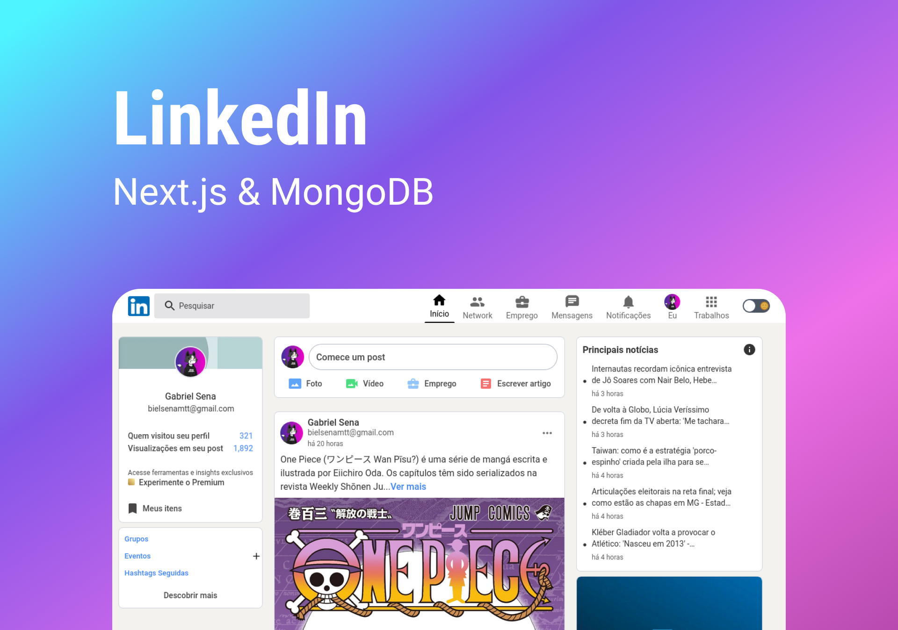

# LinkedIn | Next.js & MongoDB

> A super dynamic interface based on LinkedIn in which the user can authenticate with the Google provider, make posts and delete them. A functional widget was created in which it will always show the main updated news with redirect links to the appropriate websites, using the NEWS API. Combining Tailwindcss, Framer Motion and Headless UI, it was possible to create smooth animations and a sophisticated and minimalist interface, as well as functional modals.
